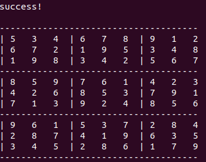

# sudoku implementation with C

usage:
```
    $ make
    $ ./sudoku
```
### modify get_input() function as you want
if you don't set anything, input is default test value. 
if you want to get std input manually, you can command in following way

(IMODE is global variable for input mode)
```
    $./sudoku --DIMODE
```

### Result pictures 
- get input

- get solution



